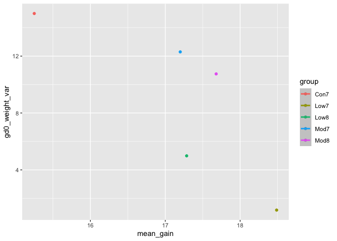

Data Import
================

This file is for data imports.

# Load Packages

``` r
library(tidyverse)
```

    ## ── Attaching core tidyverse packages ──────────────────────── tidyverse 2.0.0 ──
    ## ✔ dplyr     1.1.4     ✔ readr     2.1.5
    ## ✔ forcats   1.0.0     ✔ stringr   1.5.1
    ## ✔ ggplot2   3.5.2     ✔ tibble    3.3.0
    ## ✔ lubridate 1.9.4     ✔ tidyr     1.3.1
    ## ✔ purrr     1.2.0     
    ## ── Conflicts ────────────────────────────────────────── tidyverse_conflicts() ──
    ## ✖ dplyr::filter() masks stats::filter()
    ## ✖ dplyr::lag()    masks stats::lag()
    ## ℹ Use the conflicted package (<http://conflicted.r-lib.org/>) to force all conflicts to become errors

``` r
library(readxl)
library(haven)
library(ggplot2)
```

## Load first data set:

``` r
## Import litter df:
litters_df =
  read_csv(file = "data/FAS_litters.csv", 
           na = c('.', "NA", ""))
```

    ## Rows: 49 Columns: 8
    ## ── Column specification ────────────────────────────────────────────────────────
    ## Delimiter: ","
    ## chr (2): Group, Litter Number
    ## dbl (6): GD0 weight, GD18 weight, GD of Birth, Pups born alive, Pups dead @ ...
    ## 
    ## ℹ Use `spec()` to retrieve the full column specification for this data.
    ## ℹ Specify the column types or set `show_col_types = FALSE` to quiet this message.

``` r
## Change column labels to snake case.
litters_df = janitor::clean_names(litters_df)
```

## Load second data set:

``` r
## Import pups df:
pups_df =
  read_csv("data/FAS_pups.csv", 
           skip = 3, 
           na = c('.', "NA", ""))
```

    ## Rows: 313 Columns: 6
    ## ── Column specification ────────────────────────────────────────────────────────
    ## Delimiter: ","
    ## chr (1): Litter Number
    ## dbl (5): Sex, PD ears, PD eyes, PD pivot, PD walk
    ## 
    ## ℹ Use `spec()` to retrieve the full column specification for this data.
    ## ℹ Specify the column types or set `show_col_types = FALSE` to quiet this message.

``` r
## Change column labels to snake case.
pups_df = janitor::clean_names(pups_df)
```

## `select` some variables:

``` r
litters_df |> 
  select(group, litter_number)
```

    ## # A tibble: 49 × 2
    ##    group litter_number  
    ##    <chr> <chr>          
    ##  1 Con7  #85            
    ##  2 Con7  #1/2/95/2      
    ##  3 Con7  #5/5/3/83/3-3  
    ##  4 Con7  #5/4/2/95/2    
    ##  5 Con7  #4/2/95/3-3    
    ##  6 Con7  #2/2/95/3-2    
    ##  7 Con7  #1/5/3/83/3-3/2
    ##  8 Con8  #3/83/3-3      
    ##  9 Con8  #2/95/3        
    ## 10 Con8  #3/5/2/2/95    
    ## # ℹ 39 more rows

``` r
litters_df |> 
  select(group:gd_of_birth)
```

    ## # A tibble: 49 × 5
    ##    group litter_number   gd0_weight gd18_weight gd_of_birth
    ##    <chr> <chr>                <dbl>       <dbl>       <dbl>
    ##  1 Con7  #85                   19.7        34.7          20
    ##  2 Con7  #1/2/95/2             27          42            19
    ##  3 Con7  #5/5/3/83/3-3         26          41.4          19
    ##  4 Con7  #5/4/2/95/2           28.5        44.1          19
    ##  5 Con7  #4/2/95/3-3           NA          NA            20
    ##  6 Con7  #2/2/95/3-2           NA          NA            20
    ##  7 Con7  #1/5/3/83/3-3/2       NA          NA            20
    ##  8 Con8  #3/83/3-3             NA          NA            20
    ##  9 Con8  #2/95/3               NA          NA            20
    ## 10 Con8  #3/5/2/2/95           28.5        NA            20
    ## # ℹ 39 more rows

``` r
litters_df |> 
  select(-pups_survive)
```

    ## # A tibble: 49 × 7
    ##    group litter_number   gd0_weight gd18_weight gd_of_birth pups_born_alive
    ##    <chr> <chr>                <dbl>       <dbl>       <dbl>           <dbl>
    ##  1 Con7  #85                   19.7        34.7          20               3
    ##  2 Con7  #1/2/95/2             27          42            19               8
    ##  3 Con7  #5/5/3/83/3-3         26          41.4          19               6
    ##  4 Con7  #5/4/2/95/2           28.5        44.1          19               5
    ##  5 Con7  #4/2/95/3-3           NA          NA            20               6
    ##  6 Con7  #2/2/95/3-2           NA          NA            20               6
    ##  7 Con7  #1/5/3/83/3-3/2       NA          NA            20               9
    ##  8 Con8  #3/83/3-3             NA          NA            20               9
    ##  9 Con8  #2/95/3               NA          NA            20               8
    ## 10 Con8  #3/5/2/2/95           28.5        NA            20               8
    ## # ℹ 39 more rows
    ## # ℹ 1 more variable: pups_dead_birth <dbl>

``` r
litters_df |> 
  select(starts_with("gd"), group) # reorders columns
```

    ## # A tibble: 49 × 4
    ##    gd0_weight gd18_weight gd_of_birth group
    ##         <dbl>       <dbl>       <dbl> <chr>
    ##  1       19.7        34.7          20 Con7 
    ##  2       27          42            19 Con7 
    ##  3       26          41.4          19 Con7 
    ##  4       28.5        44.1          19 Con7 
    ##  5       NA          NA            20 Con7 
    ##  6       NA          NA            20 Con7 
    ##  7       NA          NA            20 Con7 
    ##  8       NA          NA            20 Con8 
    ##  9       NA          NA            20 Con8 
    ## 10       28.5        NA            20 Con8 
    ## # ℹ 39 more rows

``` r
litters_df |> 
  select(GROUP = group, everything())
```

    ## # A tibble: 49 × 8
    ##    GROUP litter_number   gd0_weight gd18_weight gd_of_birth pups_born_alive
    ##    <chr> <chr>                <dbl>       <dbl>       <dbl>           <dbl>
    ##  1 Con7  #85                   19.7        34.7          20               3
    ##  2 Con7  #1/2/95/2             27          42            19               8
    ##  3 Con7  #5/5/3/83/3-3         26          41.4          19               6
    ##  4 Con7  #5/4/2/95/2           28.5        44.1          19               5
    ##  5 Con7  #4/2/95/3-3           NA          NA            20               6
    ##  6 Con7  #2/2/95/3-2           NA          NA            20               6
    ##  7 Con7  #1/5/3/83/3-3/2       NA          NA            20               9
    ##  8 Con8  #3/83/3-3             NA          NA            20               9
    ##  9 Con8  #2/95/3               NA          NA            20               8
    ## 10 Con8  #3/5/2/2/95           28.5        NA            20               8
    ## # ℹ 39 more rows
    ## # ℹ 2 more variables: pups_dead_birth <dbl>, pups_survive <dbl>

## Rename and relocate data

``` r
litters_df |> 
  rename(GROUP = group)
```

    ## # A tibble: 49 × 8
    ##    GROUP litter_number   gd0_weight gd18_weight gd_of_birth pups_born_alive
    ##    <chr> <chr>                <dbl>       <dbl>       <dbl>           <dbl>
    ##  1 Con7  #85                   19.7        34.7          20               3
    ##  2 Con7  #1/2/95/2             27          42            19               8
    ##  3 Con7  #5/5/3/83/3-3         26          41.4          19               6
    ##  4 Con7  #5/4/2/95/2           28.5        44.1          19               5
    ##  5 Con7  #4/2/95/3-3           NA          NA            20               6
    ##  6 Con7  #2/2/95/3-2           NA          NA            20               6
    ##  7 Con7  #1/5/3/83/3-3/2       NA          NA            20               9
    ##  8 Con8  #3/83/3-3             NA          NA            20               9
    ##  9 Con8  #2/95/3               NA          NA            20               8
    ## 10 Con8  #3/5/2/2/95           28.5        NA            20               8
    ## # ℹ 39 more rows
    ## # ℹ 2 more variables: pups_dead_birth <dbl>, pups_survive <dbl>

``` r
litters_df |> 
  relocate(litter_number, gd0_weight) # Moves columns to the front of the DF.
```

    ## # A tibble: 49 × 8
    ##    litter_number   gd0_weight group gd18_weight gd_of_birth pups_born_alive
    ##    <chr>                <dbl> <chr>       <dbl>       <dbl>           <dbl>
    ##  1 #85                   19.7 Con7         34.7          20               3
    ##  2 #1/2/95/2             27   Con7         42            19               8
    ##  3 #5/5/3/83/3-3         26   Con7         41.4          19               6
    ##  4 #5/4/2/95/2           28.5 Con7         44.1          19               5
    ##  5 #4/2/95/3-3           NA   Con7         NA            20               6
    ##  6 #2/2/95/3-2           NA   Con7         NA            20               6
    ##  7 #1/5/3/83/3-3/2       NA   Con7         NA            20               9
    ##  8 #3/83/3-3             NA   Con8         NA            20               9
    ##  9 #2/95/3               NA   Con8         NA            20               8
    ## 10 #3/5/2/2/95           28.5 Con8         NA            20               8
    ## # ℹ 39 more rows
    ## # ℹ 2 more variables: pups_dead_birth <dbl>, pups_survive <dbl>

## In the pups data select litter \#, sex, and PD ears.

``` r
pups_df |> 
  select(litter_number, sex, pd_ears)
```

    ## # A tibble: 313 × 3
    ##    litter_number   sex pd_ears
    ##    <chr>         <dbl>   <dbl>
    ##  1 #85               1       4
    ##  2 #85               1       4
    ##  3 #1/2/95/2         1       5
    ##  4 #1/2/95/2         1       5
    ##  5 #5/5/3/83/3-3     1       5
    ##  6 #5/5/3/83/3-3     1       5
    ##  7 #5/4/2/95/2       1      NA
    ##  8 #4/2/95/3-3       1       4
    ##  9 #4/2/95/3-3       1       4
    ## 10 #2/2/95/3-2       1       4
    ## # ℹ 303 more rows

## `filter` some rows:

``` r
litters_df |> 
  filter(gd_of_birth == 20, pups_born_alive != 6, pups_born_alive < 10)
```

    ## # A tibble: 27 × 8
    ##    group litter_number   gd0_weight gd18_weight gd_of_birth pups_born_alive
    ##    <chr> <chr>                <dbl>       <dbl>       <dbl>           <dbl>
    ##  1 Con7  #85                   19.7        34.7          20               3
    ##  2 Con7  #1/5/3/83/3-3/2       NA          NA            20               9
    ##  3 Con8  #3/83/3-3             NA          NA            20               9
    ##  4 Con8  #2/95/3               NA          NA            20               8
    ##  5 Con8  #3/5/2/2/95           28.5        NA            20               8
    ##  6 Con8  #1/6/2/2/95-2         NA          NA            20               7
    ##  7 Con8  #3/5/3/83/3-3-2       NA          NA            20               8
    ##  8 Con8  #3/6/2/2/95-3         NA          NA            20               7
    ##  9 Mod7  #2/95/2-2             NA          NA            20               7
    ## 10 Mod7  #3/82/3-2             28          45.9          20               5
    ## # ℹ 17 more rows
    ## # ℹ 2 more variables: pups_dead_birth <dbl>, pups_survive <dbl>

``` r
litters_df |> 
  filter(group %in% c("Con7", "Con8"))
```

    ## # A tibble: 15 × 8
    ##    group litter_number   gd0_weight gd18_weight gd_of_birth pups_born_alive
    ##    <chr> <chr>                <dbl>       <dbl>       <dbl>           <dbl>
    ##  1 Con7  #85                   19.7        34.7          20               3
    ##  2 Con7  #1/2/95/2             27          42            19               8
    ##  3 Con7  #5/5/3/83/3-3         26          41.4          19               6
    ##  4 Con7  #5/4/2/95/2           28.5        44.1          19               5
    ##  5 Con7  #4/2/95/3-3           NA          NA            20               6
    ##  6 Con7  #2/2/95/3-2           NA          NA            20               6
    ##  7 Con7  #1/5/3/83/3-3/2       NA          NA            20               9
    ##  8 Con8  #3/83/3-3             NA          NA            20               9
    ##  9 Con8  #2/95/3               NA          NA            20               8
    ## 10 Con8  #3/5/2/2/95           28.5        NA            20               8
    ## 11 Con8  #5/4/3/83/3           28          NA            19               9
    ## 12 Con8  #1/6/2/2/95-2         NA          NA            20               7
    ## 13 Con8  #3/5/3/83/3-3-2       NA          NA            20               8
    ## 14 Con8  #2/2/95/2             NA          NA            19               5
    ## 15 Con8  #3/6/2/2/95-3         NA          NA            20               7
    ## # ℹ 2 more variables: pups_dead_birth <dbl>, pups_survive <dbl>

``` r
litters_df |> 
  drop_na()
```

    ## # A tibble: 31 × 8
    ##    group litter_number gd0_weight gd18_weight gd_of_birth pups_born_alive
    ##    <chr> <chr>              <dbl>       <dbl>       <dbl>           <dbl>
    ##  1 Con7  #85                 19.7        34.7          20               3
    ##  2 Con7  #1/2/95/2           27          42            19               8
    ##  3 Con7  #5/5/3/83/3-3       26          41.4          19               6
    ##  4 Con7  #5/4/2/95/2         28.5        44.1          19               5
    ##  5 Mod7  #59                 17          33.4          19               8
    ##  6 Mod7  #103                21.4        42.1          19               9
    ##  7 Mod7  #3/82/3-2           28          45.9          20               5
    ##  8 Mod7  #5/3/83/5-2         22.6        37            19               5
    ##  9 Mod7  #106                21.7        37.8          20               5
    ## 10 Mod7  #94/2               24.4        42.9          19               7
    ## # ℹ 21 more rows
    ## # ℹ 2 more variables: pups_dead_birth <dbl>, pups_survive <dbl>

``` r
litters_df |> 
  drop_na(gd0_weight)
```

    ## # A tibble: 34 × 8
    ##    group litter_number gd0_weight gd18_weight gd_of_birth pups_born_alive
    ##    <chr> <chr>              <dbl>       <dbl>       <dbl>           <dbl>
    ##  1 Con7  #85                 19.7        34.7          20               3
    ##  2 Con7  #1/2/95/2           27          42            19               8
    ##  3 Con7  #5/5/3/83/3-3       26          41.4          19               6
    ##  4 Con7  #5/4/2/95/2         28.5        44.1          19               5
    ##  5 Con8  #3/5/2/2/95         28.5        NA            20               8
    ##  6 Con8  #5/4/3/83/3         28          NA            19               9
    ##  7 Mod7  #59                 17          33.4          19               8
    ##  8 Mod7  #103                21.4        42.1          19               9
    ##  9 Mod7  #3/82/3-2           28          45.9          20               5
    ## 10 Mod7  #4/2/95/2           23.5        NA            19               9
    ## # ℹ 24 more rows
    ## # ℹ 2 more variables: pups_dead_birth <dbl>, pups_survive <dbl>

# In the pups data, keep only rows where PD walk is \< 11 and sex is 2:

``` r
pups_df |> 
  filter(pd_walk < 11, sex == 2)
```

    ## # A tibble: 127 × 6
    ##    litter_number   sex pd_ears pd_eyes pd_pivot pd_walk
    ##    <chr>         <dbl>   <dbl>   <dbl>    <dbl>   <dbl>
    ##  1 #1/2/95/2         2       4      13        7       9
    ##  2 #1/2/95/2         2       4      13        7      10
    ##  3 #1/2/95/2         2       5      13        8      10
    ##  4 #1/2/95/2         2       5      13        8      10
    ##  5 #1/2/95/2         2       5      13        6      10
    ##  6 #5/5/3/83/3-3     2       5      13        8      10
    ##  7 #5/5/3/83/3-3     2       5      14        7      10
    ##  8 #5/5/3/83/3-3     2       5      14        8      10
    ##  9 #5/4/2/95/2       2      NA      14        7      10
    ## 10 #5/4/2/95/2       2      NA      14        7      10
    ## # ℹ 117 more rows

## `mutate` to change columns

``` r
# Add and change some columns:
litters_df |> 
  mutate(
    wt_gain = gd18_weight - gd0_weight,
    wt_gain_squared = wt_gain^2,
    group = str_to_lower(group)
  )
```

    ## # A tibble: 49 × 10
    ##    group litter_number   gd0_weight gd18_weight gd_of_birth pups_born_alive
    ##    <chr> <chr>                <dbl>       <dbl>       <dbl>           <dbl>
    ##  1 con7  #85                   19.7        34.7          20               3
    ##  2 con7  #1/2/95/2             27          42            19               8
    ##  3 con7  #5/5/3/83/3-3         26          41.4          19               6
    ##  4 con7  #5/4/2/95/2           28.5        44.1          19               5
    ##  5 con7  #4/2/95/3-3           NA          NA            20               6
    ##  6 con7  #2/2/95/3-2           NA          NA            20               6
    ##  7 con7  #1/5/3/83/3-3/2       NA          NA            20               9
    ##  8 con8  #3/83/3-3             NA          NA            20               9
    ##  9 con8  #2/95/3               NA          NA            20               8
    ## 10 con8  #3/5/2/2/95           28.5        NA            20               8
    ## # ℹ 39 more rows
    ## # ℹ 4 more variables: pups_dead_birth <dbl>, pups_survive <dbl>, wt_gain <dbl>,
    ## #   wt_gain_squared <dbl>

# In the pups dataset, create a var that subtracts 7 from PD walk:

``` r
pups_df |> 
  mutate(
    pd_walk_minus_7 = pd_walk - 7
  )
```

    ## # A tibble: 313 × 7
    ##    litter_number   sex pd_ears pd_eyes pd_pivot pd_walk pd_walk_minus_7
    ##    <chr>         <dbl>   <dbl>   <dbl>    <dbl>   <dbl>           <dbl>
    ##  1 #85               1       4      13        7      11               4
    ##  2 #85               1       4      13        7      12               5
    ##  3 #1/2/95/2         1       5      13        7       9               2
    ##  4 #1/2/95/2         1       5      13        8      10               3
    ##  5 #5/5/3/83/3-3     1       5      13        8      10               3
    ##  6 #5/5/3/83/3-3     1       5      14        6       9               2
    ##  7 #5/4/2/95/2       1      NA      14        5       9               2
    ##  8 #4/2/95/3-3       1       4      13        6       8               1
    ##  9 #4/2/95/3-3       1       4      13        7       9               2
    ## 10 #2/2/95/3-2       1       4      NA        8      10               3
    ## # ℹ 303 more rows

# `arrange` data:

``` r
litters_df |> 
  arrange(pups_born_alive)
```

    ## # A tibble: 49 × 8
    ##    group litter_number gd0_weight gd18_weight gd_of_birth pups_born_alive
    ##    <chr> <chr>              <dbl>       <dbl>       <dbl>           <dbl>
    ##  1 Con7  #85                 19.7        34.7          20               3
    ##  2 Low7  #111                25.5        44.6          20               3
    ##  3 Low8  #4/84               21.8        35.2          20               4
    ##  4 Con7  #5/4/2/95/2         28.5        44.1          19               5
    ##  5 Con8  #2/2/95/2           NA          NA            19               5
    ##  6 Mod7  #3/82/3-2           28          45.9          20               5
    ##  7 Mod7  #5/3/83/5-2         22.6        37            19               5
    ##  8 Mod7  #106                21.7        37.8          20               5
    ##  9 Con7  #5/5/3/83/3-3       26          41.4          19               6
    ## 10 Con7  #4/2/95/3-3         NA          NA            20               6
    ## # ℹ 39 more rows
    ## # ℹ 2 more variables: pups_dead_birth <dbl>, pups_survive <dbl>

``` r
litters_df |> 
  arrange(desc(pups_born_alive))
```

    ## # A tibble: 49 × 8
    ##    group litter_number   gd0_weight gd18_weight gd_of_birth pups_born_alive
    ##    <chr> <chr>                <dbl>       <dbl>       <dbl>           <dbl>
    ##  1 Low7  #102                  22.6        43.3          20              11
    ##  2 Mod8  #5/93                 NA          41.1          20              11
    ##  3 Con7  #1/5/3/83/3-3/2       NA          NA            20               9
    ##  4 Con8  #3/83/3-3             NA          NA            20               9
    ##  5 Con8  #5/4/3/83/3           28          NA            19               9
    ##  6 Mod7  #103                  21.4        42.1          19               9
    ##  7 Mod7  #4/2/95/2             23.5        NA            19               9
    ##  8 Mod7  #8/110/3-2            NA          NA            20               9
    ##  9 Low7  #107                  22.6        42.4          20               9
    ## 10 Low7  #98                   23.8        43.8          20               9
    ## # ℹ 39 more rows
    ## # ℹ 2 more variables: pups_dead_birth <dbl>, pups_survive <dbl>

## Do multiple steps:

``` r
litters_df = read_csv(file = "data/FAS_litters.csv", 
           na = c('.', "NA", "")) |> 
  janitor::clean_names() |> 
  select(group, starts_with("gd")) |> 
  drop_na() |> 
  mutate(
    wt_gain = gd18_weight - gd0_weight
  )
```

    ## Rows: 49 Columns: 8
    ## ── Column specification ────────────────────────────────────────────────────────
    ## Delimiter: ","
    ## chr (2): Group, Litter Number
    ## dbl (6): GD0 weight, GD18 weight, GD of Birth, Pups born alive, Pups dead @ ...
    ## 
    ## ℹ Use `spec()` to retrieve the full column specification for this data.
    ## ℹ Specify the column types or set `show_col_types = FALSE` to quiet this message.

# Load pups, clean names, drop missing, keep group and pd vars and pd walk -7

``` r
pups_df = read_csv(file = "data/FAS_pups.csv",
          skip = 3,
          na = c('.', "NA", "")) |> 
  janitor::clean_names() |> 
  select(litter_number, contains("pd")) |> 
  drop_na() |> 
  mutate(
    pd_walk_minus_7 = pd_walk - 7
  )
```

    ## Rows: 313 Columns: 6
    ## ── Column specification ────────────────────────────────────────────────────────
    ## Delimiter: ","
    ## chr (1): Litter Number
    ## dbl (5): Sex, PD ears, PD eyes, PD pivot, PD walk
    ## 
    ## ℹ Use `spec()` to retrieve the full column specification for this data.
    ## ℹ Specify the column types or set `show_col_types = FALSE` to quiet this message.

# Fitting a linear model:

``` r
litters_df |> 
  lm(gd18_weight ~ gd0_weight, data = _) |> # add underscore to pipe data into the right place. 
  summary()
```

    ## 
    ## Call:
    ## lm(formula = gd18_weight ~ gd0_weight, data = litters_df)
    ## 
    ## Residuals:
    ##     Min      1Q  Median      3Q     Max 
    ## -3.7788 -1.7610 -0.3744  1.3484  4.4011 
    ## 
    ## Coefficients:
    ##             Estimate Std. Error t value Pr(>|t|)    
    ## (Intercept)  15.3424     2.8709   5.344 9.75e-06 ***
    ## gd0_weight    1.0842     0.1178   9.204 4.18e-10 ***
    ## ---
    ## Signif. codes:  0 '***' 0.001 '**' 0.01 '*' 0.05 '.' 0.1 ' ' 1
    ## 
    ## Residual standard error: 2.114 on 29 degrees of freedom
    ## Multiple R-squared:  0.745,  Adjusted R-squared:  0.7362 
    ## F-statistic: 84.72 on 1 and 29 DF,  p-value: 4.181e-10

## Scatterplot

``` r
litters_df |> 
  group_by(group) |> 
  summarize(gd0_weight_var = var(gd0_weight), gd18_weight_var = var(gd18_weight), mean_gain = mean(wt_gain)) |> 
  ggplot(aes(x = mean_gain, y = gd0_weight_var, color = group)) +
  geom_point() +
  geom_smooth(method = "lm")
```

    ## `geom_smooth()` using formula = 'y ~ x'

<!-- -->
